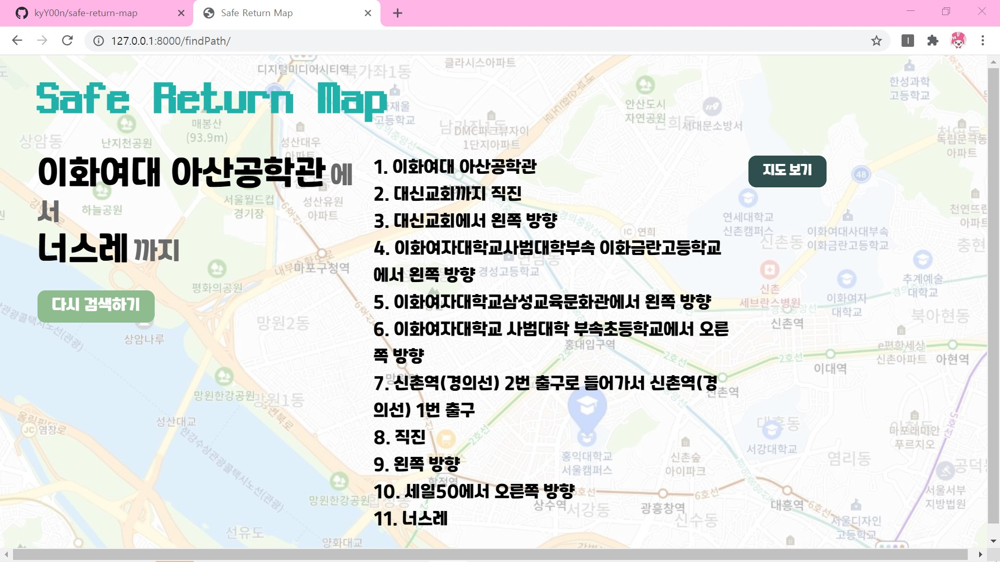
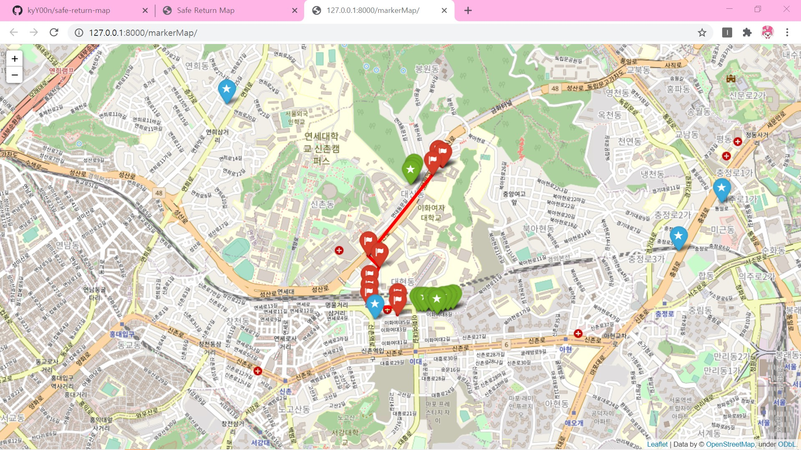

# Safe-return-map

#### 서대문구 밝은 길 안내 서비스

#### : 가로등, 경찰서 위치 공공 데이터 활용 서대문구 도보 경로 제공 서비스

------

프레임워크
: Django

------

### 서비스 기획 의도

: 서울특별시 서대문구의 가로등, CCTV, 파출소 등의 데이터를 기존 최단거리 길안내 서비스에 접목하여 표기함으로써 사용자들이 이동시 안심하며 안전하게 이동할 수 있도록 함

#### 1. 이용 대상

: 서대문구 내 희망 사용자 누구든 - 서대문구 내에서 안전한 이동을 희망하는 사용자

#### 2. 기대 효과

- 안전 귀가 실현: 사용자가 최단 거리로 이동 중 지

------

### 서비스 미리보기

- 시작 화면

  

- 경로 출력화면

  

- 지도 출력 화면 (파란색: 파출소, 초록색: 가로등, 빨간색: 최단경로)

  

------

### 향후계획

#### 1. 지도 목적에 맞게 향상/개선 예정

: 현재는 이동 중 주변 보안 요소를 안내, 추후 보안 요소들을 위주로 계산된 보행로를 길 안내로 별도 제공 예정

#### 2. 가로등, CCTV, 경찰서 위치 데이터 수집 후 서비스 제공 범위 즉시 확대 가능

: 서울특별시의 경우 각 구에서 데이터를 제공, DB구축을 위한 데이터 수집 후 즉시 반영 가능

#### ~~3. IP 문제 해결~~

~~*: 현재 AWS EC2 이용한 서버에서는 보안문제로 인해 정보 크롤링이 불가능하여  해결해야 배포 가능*~~ 네이버 클라우드 플랫폼은 된다

#### 4. 아파치 장고 연동 - collect static, DEBUG=False 설정

